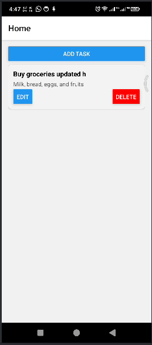
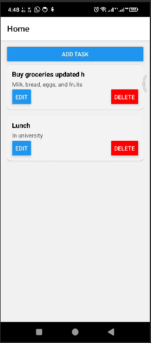
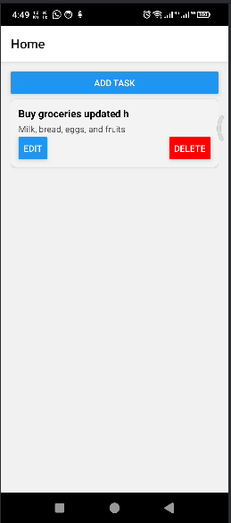
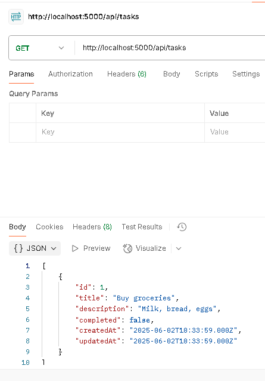
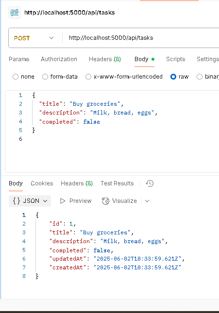
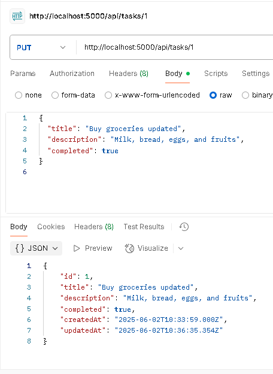
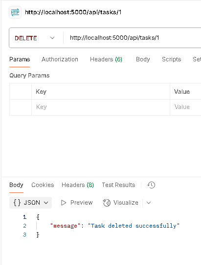

# Task Manager / To-Do App

This is a full-stack Task Manager application built with **Node.js** (backend) and **React Native** (frontend).  
It allows users to **Create, Read, Update, and Delete (CRUD)** tasks seamlessly.

## Features
- Add new tasks with task details.
- View a list of all tasks.
- Update existing tasks.
- Delete tasks that are no longer needed.
- Backend API tested thoroughly via Postman.

### Application (CRUD operations in action)
1. Add Task screen to create new tasks.  
2. Home screen showing the list of tasks.  
3. Edit Task screen to update task details.  
4. Task item with delete option to remove tasks.

### Postman (API testing for CRUD endpoints)
5. GET request to fetch all tasks.  
6. POST request to add a new task.  
7. PUT request to update a task.  
8. DELETE request to remove a task.

---

Feel free to explore and test the app and API!

## Screenshots

### Application (CRUD operations in action)
1. Add Task screen to create new tasks.  

2. Home screen showing the list of tasks.  

3. Edit Task screen to update task details.  

4. Task item with delete option to remove tasks.  

### Postman (API testing for CRUD endpoints)
5. GET request to fetch all tasks.  

6. POST request to add a new task.  

7. PUT request to update a task.  

8. DELETE request to remove a task.  

